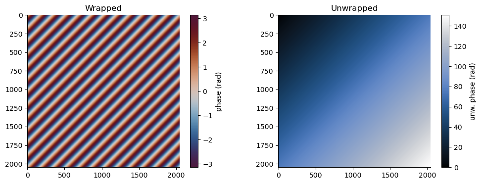

# snaphu-py

[](https://github.com/isce-framework/snaphu-py/actions/workflows/ci.yml)
[](https://codecov.io/gh/isce-framework/snaphu-py)
[](https://anaconda.org/conda-forge/snaphu)
[](https://pypi.org/project/snaphu)

A simple Python wrapper for the Statistical-Cost, Network-Flow Algorithm for Phase
Unwrapping (SNAPHU)

## Installation

### Install with conda

You can install snaphu-py with conda using

```
$ conda install -c conda-forge snaphu
```

### Install with pip

You can install snaphu-py with pip using

```
$ pip install snaphu
```

### Install from source

To install snaphu-py from source, you will need:

- Python 3.9 or newer + pip
- A C compiler

The latest source code can be installed using

```
$ pip install git+https://github.com/isce-framework/snaphu-py.git
```

Alternatively, clone the repository (be sure to use the `--recursive` flag to fetch the
Git submodules) and install the local copy using

```
$ git clone --recursive https://github.com/isce-framework/snaphu-py.git
$ cd snaphu-py
$ pip install .
```

## Usage

### Basic usage

The main interface is the `snaphu.unwrap` function, which takes input interferogram and
coherence arrays and returns the unwrapped phase and connected component labels.

The inputs may be NumPy arrays or any other type of object that supports a similar
interface (h5py Datasets, Zarr Arrays, etc).

The following example illustrates basic usage:

```python
import numpy as np
import snaphu

# Simulate a 512x512 interferogram containing a simple diagonal phase ramp with multiple
# fringes.
y, x = np.ogrid[-3:3:512j, -3:3:512j]
igram = np.exp(1j * np.pi * (x + y))

# Sample coherence for an interferogram with no noise.
corr = np.ones(igram.shape, dtype=np.float32)

# Unwrap using the 'SMOOTH' cost mode and 'MCF' initialization method.
unw, conncomp = snaphu.unwrap(igram, corr, nlooks=1.0, cost="smooth", init="mcf")
```

The wrapped and unwrapped phase are shown below.

<p align="center">
  
</p>

### Working with geospatial raster data

Optional support for working with geospatial raster data is provided via the
`snaphu.io.Raster` class, which implements a NumPy-like interface for accessing raster
data in [GDAL-compatible formats].

*This functionality requires the [rasterio] package.*

[GDAL-compatible formats]: https://gdal.org/drivers/raster/
[rasterio]: https://rasterio.readthedocs.io/

```python
import snaphu

# Open the input interferogram and coherence rasters as well as a water mask.
igram = snaphu.io.Raster("igram.tif")
corr = snaphu.io.Raster("corr.tif")
mask = snaphu.io.Raster("mask.tif")

# Create output rasters to store the unwrapped phase & connected component labels with
# the same shape, driver, CRS/geotransform, etc as the input interferogram raster.
unw = snaphu.io.Raster.create("unw.tif", like=igram, dtype="f4")
conncomp = snaphu.io.Raster.create("conncomp.tif", like=igram, dtype="u4")

# Unwrap and store the results in the `unw` and `conncomp` rasters.
snaphu.unwrap(igram, corr, nlooks=50.0, mask=mask, unw=unw, conncomp=conncomp)
```

The wrapped[^1] and unwrapped phase for an example case are shown below.

<p align="center">
  
</p>

`snaphu.io.Raster` implements Python's [context manager protocol], so the above snippet
could also be written as:

[context manager protocol]: https://peps.python.org/pep-0343/

```python
import snaphu

# Open the input rasters and create output rasters as context managers. The data will be
# flushed and the files closed upon exiting the 'with' block. (Note that this syntax
# requires Python 3.10 or newer -- see https://github.com/python/cpython/issues/56991.)
with (
    snaphu.io.Raster("igram.tif") as igram,
    snaphu.io.Raster("corr.tif") as corr,
    snaphu.io.Raster("mask.tif") as mask,
    snaphu.io.Raster.create("unw.tif", like=igram, dtype="f4") as unw,
    snaphu.io.Raster.create("conncomp.tif", like=igram, dtype="u4") as conncomp,
):
    # Unwrap and store the results in the `unw` and `conncomp` rasters.
    snaphu.unwrap(igram, corr, nlooks=50.0, mask=mask, unw=unw, conncomp=conncomp)
```

This has the advantage of ensuring that the raster datasets are flushed and closed upon
exiting the `with` block.

### Tiling and parallelism

The interferogram may be partitioned into multiple (possibly overlapping)
regularly-sized rectangular blocks, each of which is unwrapped independently before
being reassembled. This tiling strategy can significantly improve unwrapping runtime and
reduce peak memory utilization, but may also introduce phase discontinuities between
tiles. In order to mitigate such tiling artifacts, choosing a substantial overlap
between tiles is recommended.

Multiple tiles may be unwrapped simultaneously in parallel processes.

The following example demonstrates tiled unwrapping using multiple processes:

```python
import numpy as np
import snaphu

# Simulate a 2048x2048 interferogram containing a simple diagonal phase ramp with many
# fringes.
y, x = np.ogrid[-12:12:2048j, -12:12:2048j]
igram = np.exp(1j * np.pi * (x + y))

# Sample coherence for an interferogram with no noise.
corr = np.ones(igram.shape, dtype=np.float32)

# Unwrap using a 4x4 grid of tiles in parallel using 8 processes.
unw, conncomp = snaphu.unwrap(
    igram, corr, nlooks=1.0, ntiles=(4, 4), tile_overlap=256, nproc=8
)
```

The wrapped and unwrapped phase are shown below.

<p align="center">
  
</p>

## FAQ

### Why isn't [*some configuration parameter*] exposed?

The full set of SNAPHU parameters includes >100 configurable options. This project takes
a pragmatic (and somewhat opinionated) approach to managing this complexity. Only the
most commonly manipulated parameters are exposed.

If there's an option that's not currently supported that you'd like to see added to the
interface, feel free to open an issue requesting the addition.

### What version of SNAPHU is used?

Our goal is to support the [latest available SNAPHU release]. The SNAPHU version used by
the library can be obtained using

```python
>>> import snaphu
>>> print(snaphu.get_snaphu_version())
```

[latest available SNAPHU release]:
  https://web.stanford.edu/group/radar/softwareandlinks/sw/snaphu/

## Copyright

Copyright (c) 2023 California Institute of Technology ("Caltech"). U.S. Government
sponsorship acknowledged.

All rights reserved.

## License

This software is licensed under your choice of BSD-3-Clause or Apache-2.0 licenses. The
exact terms of each license can be found in the accompanying [LICENSE-BSD-3-Clause] and
[LICENSE-Apache-2.0] files, respectively.

[LICENSE-BSD-3-Clause]: LICENSE-BSD-3-Clause
[LICENSE-Apache-2.0]: LICENSE-Apache-2.0

SPDX-License-Identifier: BSD-3-Clause OR Apache-2.0

> [!NOTE]
> The SNAPHU source code (which is included as a Git submodule) is subject to different
> license terms, the details of which can be found [here]. In particular, note that
> parts of the SNAPHU codebase are subject to terms that prohibit commercial use.

[here]: https://github.com/gmgunter/snaphu/blob/main/README

[^1]: InSAR product processed by ASF DAAC HyP3 2023 using GAMMA software. Contains
  modified Copernicus Sentinel data 2023, processed by ESA.
